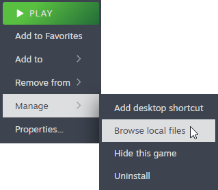

Getting started with modding can be a bit of a hassle at first, but once you get the hang of it, it's a breeze. This guide will help you get started with modding in Unturned.

## Prerequisites
Before you start modding, you will need to have the following installed:
[Unity 2021.3.29f1](https://unity.com/download)

[(Optional) Blender](https://www.blender.org/) or any other 3D modeling software.

## Setting up Unity

### Installing Unity
Be sure you have Unity installed, if that is not the case, go back to the [Prerequisites](#prerequisites) section and install it.

### Creating the project
Open Unity Hub, and press the "New project" button.

Select the correct version of Unity & the 3D template.

Give a name & choose a location for your project, both can be whatever you want.

Once you have chosen a directory, press the "Create project" button.

### Importing the Unturned assets
Once Unity has loaded, we will import the Unturned assets.
These assets contain some example models, textures & prefabs, going through all of these will help give you an understanding of how to make different items and anything else for Unturned.

Regardless, to import the assets, go to Steam and right click on Unturned, then press Manage -> Browse local files.

Once you are in the Unturned Directory, go to the `Extras` -> `Sources` folder.

In this folder you will find to files with the extension `.unitypackage` / `Unity package file`, these are the assets we need to import into Unity.

Start off by double clicking on `Project.unitypackage`, this will import the main project settings and hooks.
After it is done importing, double click on the `ExampleAssets.unitypackage`, this will import the example assets.

### Opening the bundling tools
Once you have imported the assets, we can open our 2 bundling tools, `Bundle Tool` & `Master Bundle Tool`.

You can open these by by going to `Window -> Unturned -> Bundle Tool` & `Window -> Unturned -> Master Bundle Tool`.

Once you have opened the tools, you can start creating your own items, or you can start by modifying the example assets.
